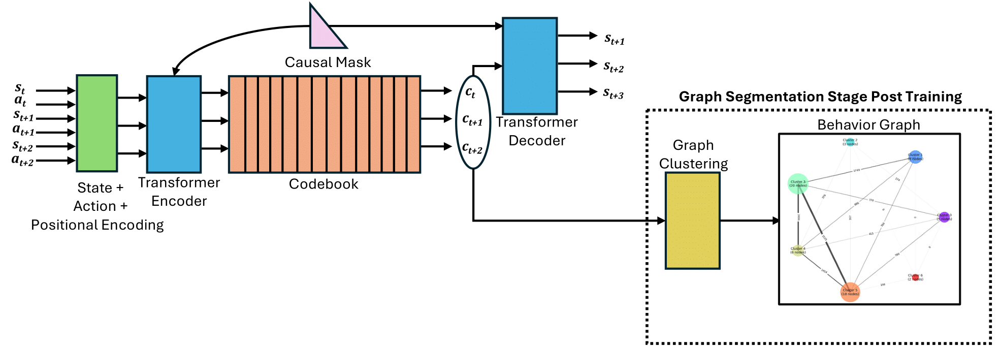

# Behaviour Discovery and Attribution for Explainable Reinforcement Learning
This is the codebase for our paper "Behaviour Discovery and Attribution for Explainable Reinforcement Learning". We conduct our experiments on three main environments with details as stated below.
More details about the project can be found at [rish-av.github.io/bexrl](https://rish-av.github.io/bexrl).

## Overview
Explaining the decisions made by reinforcement learning (RL) agents is critical for building trust and ensuring reliability in real-world applications. Traditional approaches to explainability often rely on saliency analysis, which can be limited in providing actionable insights. Recently, there has been growing interest in attributing RL decisions to specific trajectories within a dataset. However, these methods often generalize explanations to long trajectories, potentially involving multiple distinct behaviors. Often, providing multiple more fine-grained explanations would improve clarity. In this work, we propose a framework for behavior discovery and action attribution to behaviors in offline RL trajectories. Our method identifies meaningful behavioral segments, enabling more precise and granular explanations associated with high-level agent behaviors. This approach is adaptable across diverse environments with minimal modifications, offering a scalable and versatile solution for behavior discovery and attribution for explainable RL.

The architecture of our pipeline is shown below.

*Figure 1: A transformer-based VQ-VAE is used for behavior discovery, where state-action sequences are encoded, discretized via a codebook, and decoded to predict future states. The resulting latent codes are used to construct a graph, and the graph clustering module partitions the graph into subgraphs, each representing a “behavior”. A causal mask is applied to both the decoder and the encoder to restrict access to future information.*

## HalfCheetah-medium-v2 (Mujoco)

To train mujoco and generate the behavior chart, we need to run `python train_mujoco.py --log` (`--log` enables wandb logging). For other params, please refer to the argument parser of mujoco.

## MiniGridTwoGoalsLava
MiniGridTwoGoalsLava is a custom envrionment we created for generating data to train our architecture. The environment has two goals and one lava. To generate the data where the agent reaches goal1 20 times, goal2 30 times and lava 10 times (this variation is important to ensure that our dataset has good vareity), you need to run `python collect_minigrid_data.py --g1_threshold 20 --g2_threshold 20 --l_threshold 10 --data_path data.pkl`. 

Now to train the agent and generate the behavior graph, you need to run `python train_minigrid.py --dataset_path data.pkl`, other parameters are listed out in the argument parsing function.

## Seaquest-mixed-v0 (Atari)
To train mujoco and generate the behavior chart, we need to run `python train_atari.py --log` (`--log` enables wandb logging). For other params, please refer to the argument parser of atari. 

